# Mermaid samples

A corpus for the mermaid work. Every diagram is deliberately small, so it
isolates one feature that has to be drawn, and the note under each heading says
what the renderer is expected to do with it.

Until diagrams are drawn, each fence appears as a dimmed source panel labelled
`mermaid`.

## Pie chart

The easiest case, and a good first win: lengths derived from percentages, with no
routing at all.

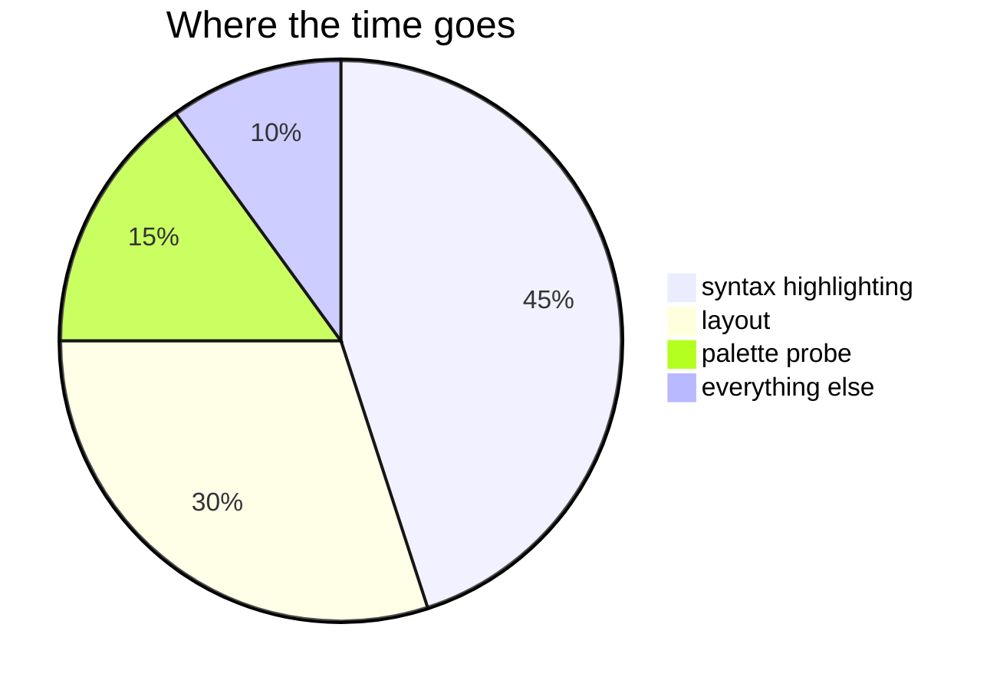

## Flowchart, top to bottom

The baseline: a branch, a decision and edge labels. Expect three levels, `{...}`
drawn as a diamond, and `yes`/`no` placed beside their edges.

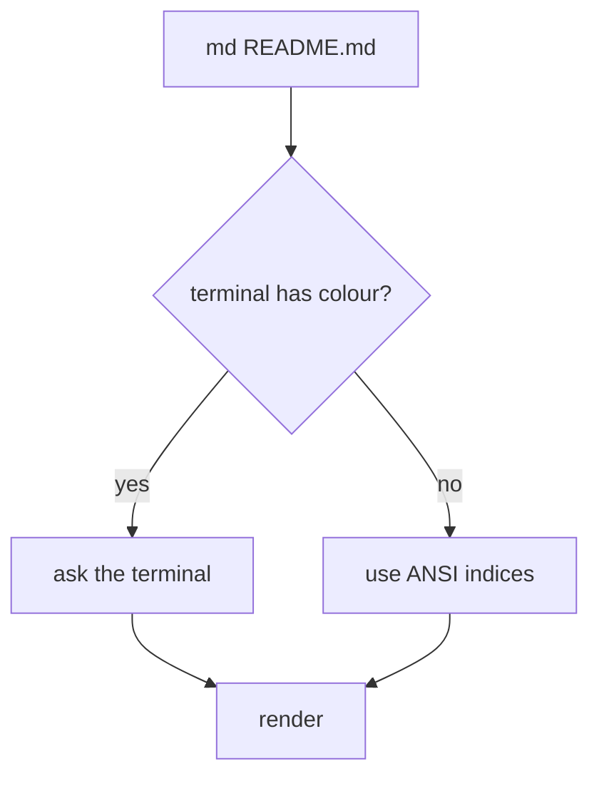

## Flowchart, left to right

The same shape in the other direction: layout must follow the declared direction
rather than always stacking downwards.

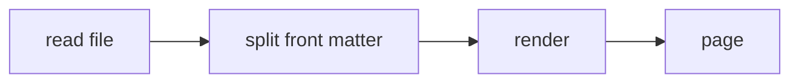

## Node shapes and edge styles

Stadium, subroutine, cylinder and circle nodes, plus dotted and thick edges.

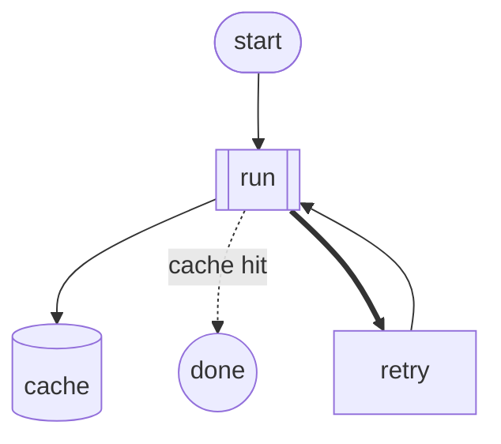

## A cycle

Edges that go back on themselves: the router must terminate.

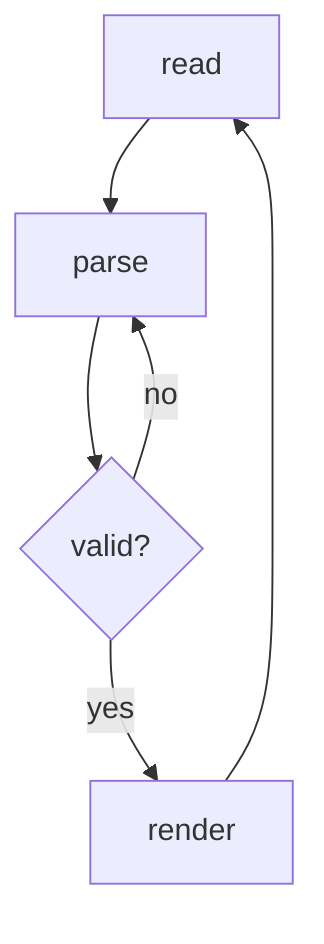

## Long labels

Text wider than the terminal: the box has to grow or the label has to wrap,
without the frame coming apart.

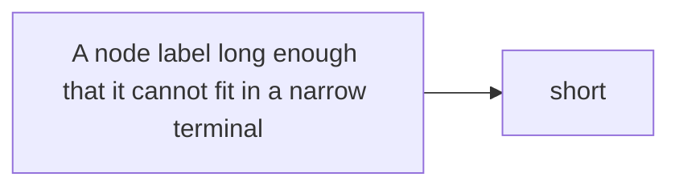

## Subgraph

A container drawn around part of the graph.

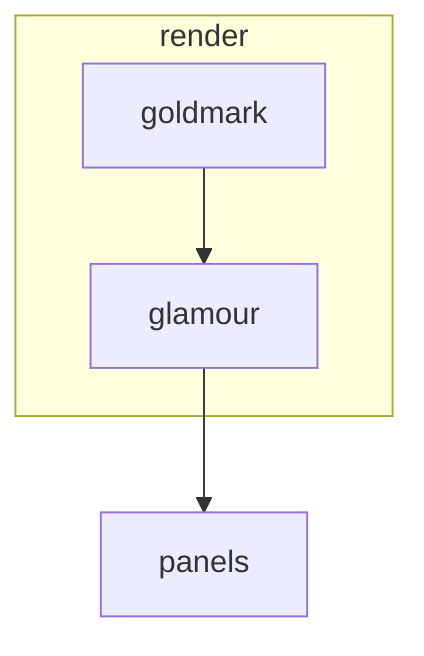

## Sequence diagram

Participants, messages both ways, a note and a loop.

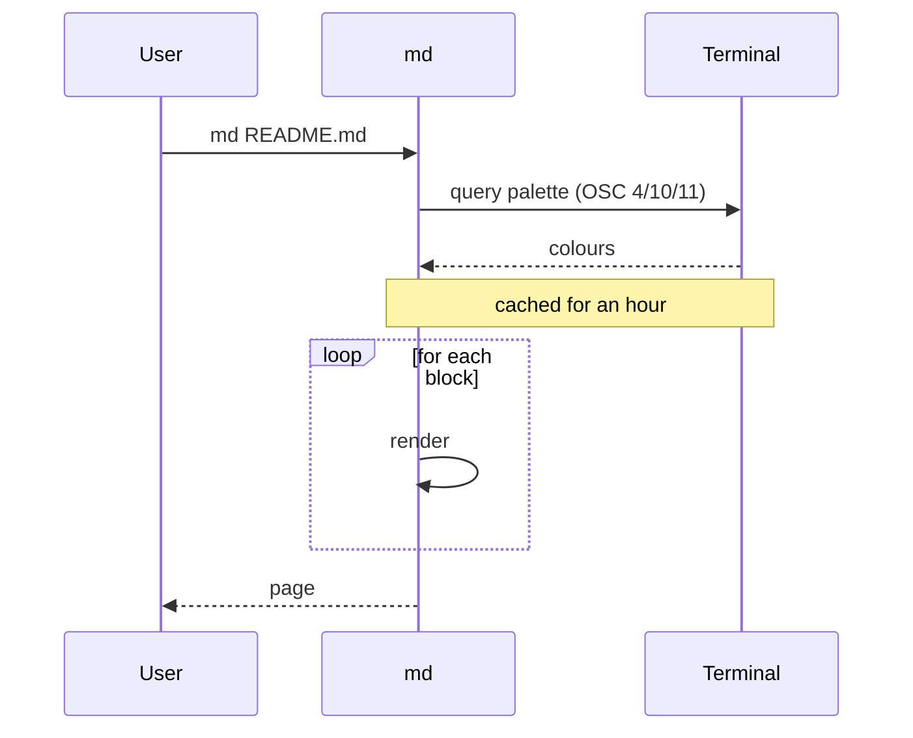

## Styling directives

`style` and `classDef` carry colours md will ignore: the terminal's palette wins,
and the diagram still has to read.

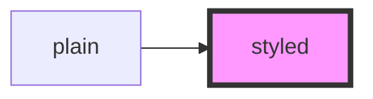

## Unicode and emoji

Width is measured in cells, not bytes: the frame must stay square.

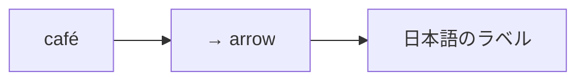

## Comments and blank lines

`%%` comments and stray blanks must be ignored rather than drawn.

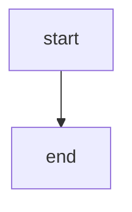

## Not a diagram

An unparseable body: give up and fall back to the dimmed source panel rather
than drawing nonsense.

```mermaid
this is not a diagram at all
    ??? --> !!!
```

## A diagram with no language

For contrast, a plain fence: not detected as mermaid, drawn as an ordinary code
panel.

```
graph TD
    A --> B
```
