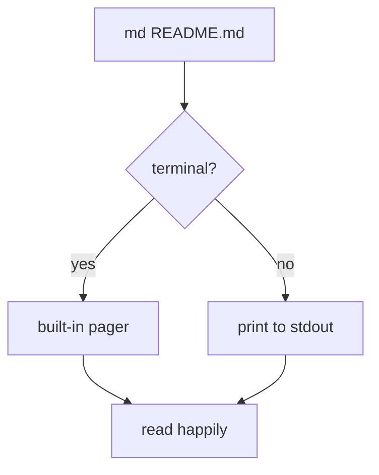

# md

A terminal Markdown renderer that tries hard to look like something you would
*enjoy* reading, rather than a wall of monospaced text.

## Why another one?

Most Markdown viewers in a terminal fall into one of two camps: they either
dump a pile of `#` characters at you, or they hard-code a colour scheme that
fights with whatever theme you have spent years tuning. `md` aims to sit in the
middle: **the structure comes from Markdown, the colours come from your
terminal**.

> Good typography is invisible. You should notice the *content*, not the
> renderer.
>
> — everyone who has ever read a README

### Features at a glance

- GFM tables with box drawing borders
- Nested lists, task lists and footnotes[^1]
- Fenced code blocks with a language label and real syntax highlighting
- Mermaid diagrams, framed so they are at least not *invisible*
- Front matter, YAML or TOML, as a metadata panel

Tasks look like this:

- [x] Read the terminal's palette instead of guessing
- [x] Draw panels with box drawing characters
- [ ] Render mermaid diagrams properly

### Inline styles

You can write **bold**, *emphasis* (though several terminals render italics as
reverse video, so `md` leaves it alone by default), ~~strikethrough~~, and
`inline code`. Links look like [the charm docs](https://charm.sh) and bare
autolinks such as https://go.dev are detected too.

Definition lists work as well:

md
: a small terminal Markdown renderer

less
: the pager everyone already knows how to use

---

## Code

Go code, with a language label:

```go
package main

import "fmt"

func main() {
	names := []string{"ada", "grace", "edsger"}
	for i, name := range names {
		fmt.Printf("%d: %s\n", i+1, name)
	}
}
```

Python, which md will highlight with the same palette:

```python
from dataclasses import dataclass


@dataclass
class Palette:
    slots: list[str]

    def darkest(self) -> str:
        return min(self.slots, key=lambda c: sum(int(c[i:i + 2], 16) for i in (1, 3, 5)))
```

An unknown language, which should still be framed and readable:

```brainfuck-not-really
this language has no lexer, so md falls back to plain text
+ +++[->++++<]>[->++++<]>.
```

And code with no language at all:

```
$ md README.md
$ echo "the tree is a fence" | md -
```

A line that is deliberately far too long to fit inside a panel, to check that it degrades gracefully instead of being truncated: aaaaaaaaaaaaaaaaaaaaaaaaaaaaaaaaaaaaaaaaaaaaaaaaaaaaaaaaaaaaaaaaaaaaaaaa end.

## Tables

| Option | Type | Default | What it does |
| ------ | :--: | ------: | ------------ |
| `--width` | int | terminal | render width in columns |
| `--theme` | string | auto | dark, light or mono |
| `--pager` | string | auto | builtin, less or none |
| `--mermaid` | string | box | frame mermaid source, or off |

Alignment, wrapping in narrow terminals and inline `code` inside cells should
all survive.

## Mermaid



## Nesting

1. First, detect the terminal
   - palette via OSC 4
   - background via OSC 11
2. Then render
   > Even quotes inside lists indent correctly.
   >
   > ```sh
   > md --pager=none README.md | head -40
   > ```
3. Then display

| Not a table | Just checking quoting |
| ----------- | --------------------- |
| `a\|b`      | escaped pipes work    |

That is everything. Now scroll around with `j`/`k`, `space`, `g`/`G`, and press
`q` when you are done.

[^1]: Footnotes are rendered where you would expect them, with a link back to
    the reference.
